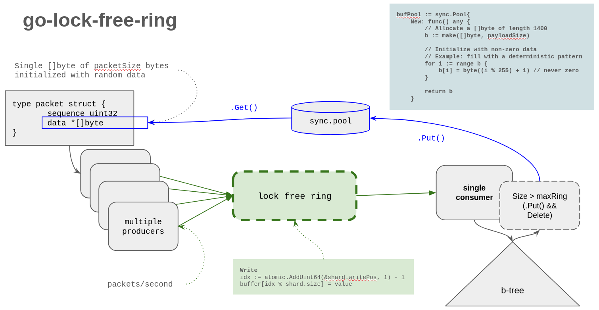

# go-lock-free-ring

Simple example of a lock free ring library written in golang.

ring.go is an example program using the ring library with integration tests to demonstrate the performance.



## Background - Lock free rings
There are lots of lock free rings, where Herb does a good job explaining them in this video

e.g.
CppCon 2014: Herb Sutter "Lock-Free Programming (or, Juggling Razor Blades), Part I"
https://youtu.be/c1gO9aB9nbs?si=K2y67zBI8HGfmFHF

## Inspiration

To implment this found this blog, so I gave it a quick shot

https://congdong007.github.io/2025/08/16/Lock-Free-golang/

From the blog:
```bash
Fundamental Concepts

    Ring Buffer
        A ring buffer (or circular buffer) is a fixed-size queue in which the write and read pointers wrap around once they reach the end of the underlying array. It is widely used in high-performance systems such as logging pipelines, network buffers, and message queues.

    MPSC (Multi-Producer, Single-Consumer)

        An MPSC queue allows multiple producers (writers) to insert elements concurrently, while only a single consumer (reader) retrieves elements.

        Write operations must address concurrent access among producers.

        Read operations are simpler, as they are performed by a single consumer thread.

    Lock-Free
        Instead of using traditional mutexes, lock-free structures rely on atomic operations (e.g., Compare-And-Swap, CAS) to ensure correctness under concurrency. This avoids lock contention, reducing latency and improving throughput.

    Sharded
        A sharded design partitions a large ring buffer into several smaller independent sub-buffers (shards). Producers are distributed across shards (e.g., by hashing or thread affinity), which minimizes contention. The consumer then sequentially or cyclically retrieves items from all shards.

Operating Principles

A sharded lock-free MPSC ring buffer typically operates as follows:

    Initialization

        The total buffer capacity is divided into N shards (e.g., 8 sub-buffers).

        Each shard itself is implemented as a lock-free MPSC ring buffer.

    Producer Writes (Concurrent)

        Each producer selects a shard based on a hash function, producer ID, or randomized strategy.

        The producer atomically advances the write pointer in that shard using CAS and writes its data.

        Because writes are distributed across shards, contention is significantly reduced.

    Consumer Reads (Single Thread)

        The consumer iterates over all shards, checking each for available entries.

        Data is retrieved by advancing the shard’s read pointer.

        As only one consumer exists, no synchronization overhead is required for reading.

Motivation for Sharding

    Challenge with Conventional MPSC Buffers
        In a non-sharded MPSC buffer, all producers compete on a single shared write pointer, resulting in substantial contention under high concurrency.

    Benefits of Sharding

        Each shard has fewer competing producers, reducing contention on its write pointer.

        The single consumer can still process data deterministically by scanning all shards.

        Performance gains are particularly evident when the number of producers is large relative to the consumer.

Application Scenarios

    High-performance logging systems (multiple threads writing logs, one thread persisting to storage).

    Network servers (multiple connections producing packets, one thread aggregating and processing them).

    Data acquisition systems (multiple sensors producing input, one thread consuming for analysis).

Implementation Notes in Golang

    In Go, the sync/atomic package is typically used for lock-free synchronization.
    Key implementation aspects include:

    Write Operation

idx := atomic.AddUint64(&shard.writePos, 1) - 1
buffer[idx % shard.size] = value

    Read Operation (single-threaded, no CAS required)

if shard.readPos < shard.writePos {
    val := buffer[shard.readPos % shard.size]
    shard.readPos++
    return val
}

    Shard Selection

shardID := hash(producerID) % numShards
shard := shards[shardID]

    Consumer Loop

for {
    for _, shard := range shards {
        if val, ok := shard.TryRead(); ok {
            process(val)
        }
    }
}

Advantages and Limitations

    Advantages

        Lock-free design avoids mutex contention.

        Sharding reduces producer contention and increases throughput.

        Single-consumer semantics simplify design and maintain order within each shard.

    Limitations

        The consumer must poll multiple shards, which may increase latency with many shards.

        Buffer utilization may be uneven if some shards are heavily loaded while others remain idle.

        The design does not extend naturally to multiple consumers.


```

## Ring Library Design

This section describes the detailed implementation of the `ring.go` lock-free ring buffer library.

### Architecture Overview

The library implements a **Sharded Lock-Free MPSC (Multi-Producer, Single-Consumer) Ring Buffer**. The design partitions a single large ring buffer into multiple independent shards, where each shard is itself a lock-free circular buffer. This approach dramatically reduces write contention among producers while maintaining simplicity for the single consumer.

```
┌─────────────────────────────────────────────────────────────────┐
│                      ShardedRing                                │
│  ┌─────────┐  ┌─────────┐  ┌─────────┐       ┌─────────┐       │
│  │ Shard 0 │  │ Shard 1 │  │ Shard 2 │  ...  │ Shard N │       │
│  │ ┌─────┐ │  │ ┌─────┐ │  │ ┌─────┐ │       │ ┌─────┐ │       │
│  │ │ buf │ │  │ │ buf │ │  │ │ buf │ │       │ │ buf │ │       │
│  │ │ [0] │ │  │ │ [0] │ │  │ │ [0] │ │       │ │ [0] │ │       │
│  │ │ [1] │ │  │ │ [1] │ │  │ │ [1] │ │       │ │ [1] │ │       │
│  │ │ ... │ │  │ │ ... │ │  │ │ ... │ │       │ │ ... │ │       │
│  │ │ [n] │ │  │ │ [n] │ │  │ │ [n] │ │       │ │ [n] │ │       │
│  │ └─────┘ │  │ └─────┘ │  │ └─────┘ │       │ └─────┘ │       │
│  │writePos │  │writePos │  │writePos │       │writePos │       │
│  │readPos  │  │readPos  │  │readPos  │       │readPos  │       │
│  └─────────┘  └─────────┘  └─────────┘       └─────────┘       │
└─────────────────────────────────────────────────────────────────┘
        ▲               ▲               ▲               ▲
        │               │               │               │
   Producer 0      Producer 1      Producer 2      Producer N
   (hash → 0)      (hash → 1)      (hash → 2)      (hash → N)

                              │
                              ▼
                    ┌─────────────────┐
                    │  Single Reader  │
                    │  (polls all     │
                    │   shards)       │
                    └─────────────────┘
```

### Data Structures

#### Slot Structure

Each slot holds a value with a sequence number for race-free concurrent access:

```go
type slot struct {
    seq   uint64  // Sequence number - signals when data is ready
    value any     // The stored value
}
```

The sequence number enables lock-free synchronization:
- **Initial state**: `seq = slotIndex` (slot is available for writing at position `slotIndex`)
- **After write**: `seq = writePos + 1` (signals data is ready for reading)
- **After read**: `seq = readPos + size` (marks slot available for next write cycle)

#### Shard Structure

Each shard is an independent lock-free ring buffer:

```go
type Shard struct {
    buffer   []slot   // circular buffer with per-slot sequence numbers
    size     uint64   // capacity of this shard
    writePos uint64   // atomic: next position to claim for writing
    readPos  uint64   // atomic: next position to read from
    //_        [40]byte // cache line padding to prevent false sharing
}
```

**Cache Line Padding**: The padding field helps prevent false sharing between shards. The optimal padding size depends on:

1. **Cache line size**: Typically 64 bytes on modern x86/ARM CPUs
2. **Struct layout**: The Shard fields before padding total 48 bytes:
   - `buffer []slot` = 24 bytes (slice header: pointer + len + cap)
   - `size uint64` = 8 bytes
   - `writePos uint64` = 8 bytes
   - `readPos uint64` = 8 bytes
3. **Allocation pattern**: Since `[]*Shard` uses pointers, each shard is heap-allocated separately

**Determining optimal padding**: Run `go test -bench=ShardPadding` to benchmark different sizes. The current 40-byte padding results in 88-byte total struct size. Benchmarks show performance is relatively stable across padding sizes (0-56 bytes) because heap allocation naturally spreads shards across cache lines.

#### ShardedRing Structure

The main ring structure manages multiple shards:

```go
type ShardedRing struct {
    shards    []*Shard  // array of shard pointers
    numShards uint64    // number of shards (power of 2 recommended)
    mask      uint64    // numShards - 1, for fast modulo via bitwise AND
}
```

### API Design

#### Constructor

```go
func NewShardedRing(totalCapacity uint64, numShards uint64) *ShardedRing
```

- `totalCapacity`: Total number of items the ring can hold across all shards
- `numShards`: Number of shards to partition the ring into (must be power of 2)
- Each shard capacity = `totalCapacity / numShards`

#### Producer Interface

**Non-blocking write (immediate return):**

```go
func (r *ShardedRing) Write(producerID uint64, value any) bool
```

- `producerID`: Unique identifier for the producer (used for shard selection)
- `value`: The data to write into the ring
- Returns `true` on success, `false` if the selected shard is full

**Write with configurable backoff:**

```go
func (r *ShardedRing) WriteWithBackoff(producerID uint64, value any, config WriteConfig) bool
```

When the ring is full, this method retries with backoff instead of immediately returning false:

```go
type WriteConfig struct {
    MaxRetries      int           // Attempts before sleeping (default: 10)
    BackoffDuration time.Duration // Sleep duration after retries (default: 100µs)
    MaxBackoffs     int           // Max backoff cycles, 0 = unlimited (default: 0)
}

// Example usage:
config := ring.WriteConfig{
    MaxRetries:      10,                    // Try 10 times before sleeping
    BackoffDuration: 100 * time.Microsecond, // Sleep 100µs between batches
    MaxBackoffs:     1000,                  // Give up after 1000 cycles
}
if !ring.WriteWithBackoff(producerID, value, config) {
    // Ring persistently full - handle backpressure
}
```

This reduces CPU spinning when producers outpace the consumer, trading latency for efficiency.

#### Consumer Interface

```go
func (r *ShardedRing) TryRead() (any, bool)
```

- Attempts to read one item from any shard
- Returns the value and `true` if an item was read
- Returns `nil` and `false` if all shards are empty

```go
func (r *ShardedRing) ReadBatch(maxItems int) []any
```

- Reads up to `maxItems` from all shards in a round-robin fashion
- Returns a slice of items read (may be empty if ring is empty)
- More efficient for batch processing scenarios

### Implementation Details

#### Per-Slot Sequence Numbers (Race-Free Design)

The implementation uses per-slot sequence numbers to ensure race-free operation without global serialization. This design is inspired by the LMAX Disruptor pattern.

**Why per-slot sequences?** A naive implementation might use a global "committed" counter, but this creates a serialization bottleneck where producers must commit in order. Per-slot sequences allow independent commits:

| Approach | Concurrent Write Performance |
|----------|------------------------------|
| Global committed counter | 11,000,000+ ns/op (500,000x slower!) |
| Per-slot sequence | 24 ns/op ✓ |

#### Write Operation (Lock-Free)

```go
func (s *Shard) write(value any) bool {
    // Atomically claim the next write slot
    pos := atomic.AddUint64(&s.writePos, 1) - 1
    idx := pos % s.size
    sl := &s.buffer[idx]

    // Check if slot is available (seq == pos means slot is free)
    seq := atomic.LoadUint64(&sl.seq)
    if seq != pos {
        // Slot not available - ring is full
        atomic.AddUint64(&s.writePos, ^uint64(0)) // unclaim
        return false
    }

    // Write the value
    sl.value = value

    // Signal data is ready (seq = pos+1)
    atomic.StoreUint64(&sl.seq, pos+1)

    return true
}
```

**Key Points**:
- `atomic.AddUint64` claims a unique position for each producer
- Slot availability is checked via sequence number, not global counter
- Each producer can commit independently (no waiting for others)
- The sequence update signals to the consumer that data is ready

#### Read Operation (Single Consumer)

```go
func (s *Shard) tryRead() (any, bool) {
    readPos := atomic.LoadUint64(&s.readPos)
    idx := readPos % s.size
    sl := &s.buffer[idx]

    // Check if data is ready (seq should be readPos+1)
    seq := atomic.LoadUint64(&sl.seq)
    if seq != readPos+1 {
        return nil, false // Not ready
    }

    // Read and clear value
    value := sl.value
    sl.value = nil

    // Mark slot available for next write cycle (seq = readPos+size)
    atomic.StoreUint64(&sl.seq, readPos+s.size)

    // Advance read position
    atomic.StoreUint64(&s.readPos, readPos+1)

    return value, true
}
```

**Key Points**:
- Sequence check ensures data is fully written before reading
- Clearing `sl.value = nil` helps the garbage collector
- Setting `seq = readPos + size` marks the slot available for the next write at that position
- All operations on shared state use atomics for race-free access

#### Shard Selection

Producers are distributed across shards using a hash function:

```go
func (r *ShardedRing) selectShard(producerID uint64) *Shard {
    // Fast modulo for power-of-2 shard counts
    shardIdx := producerID & r.mask
    return r.shards[shardIdx]
}
```

Alternative selection strategies:
- **Round-robin per producer**: Each producer maintains its own counter and cycles through shards
- **Random selection**: `rand.Uint64() & r.mask` for load balancing
- **Thread affinity**: Use goroutine ID (if available) for cache locality

#### Consumer Polling Loop

The consumer iterates through all shards to collect available data:

```go
func (r *ShardedRing) ReadBatch(maxItems int) []any {
    result := make([]any, 0, maxItems)

    // Round-robin through all shards
    for i := uint64(0); i < r.numShards && len(result) < maxItems; i++ {
        shard := r.shards[i]
        for len(result) < maxItems {
            if val, ok := shard.TryRead(); ok {
                result = append(result, val)
            } else {
                break // this shard is empty
            }
        }
    }

    return result
}
```

### Memory Management Integration

The ring library is designed to work with `sync.Pool` for efficient memory reuse:

#### Producer Side

```go
// Get buffer from pool
buf := bufPool.Get().([]byte)

// Create packet with pooled buffer
pkt := &packet{
    sequence: nextSeq,
    data:     &buf,
}

// Write to ring
ring.Write(producerID, pkt)
```

#### Consumer Side

```go
// Read from ring
items := ring.ReadBatch(1000)

for _, item := range items {
    pkt := item.(*packet)

    // Process packet...

    // Return buffer to pool when done
    bufPool.Put(*pkt.data)
}
```

### Synchronization Strategy Summary

| Operation | Synchronization | Reason |
|-----------|-----------------|--------|
| Write (claim slot) | `atomic.AddUint64` | Multiple producers compete for slots |
| Write (store value) | None | Each producer writes to its own claimed slot |
| Read (check availability) | `atomic.LoadUint64` on writePos | See latest producer progress |
| Read (load value) | None | Single consumer, no competition |
| Read (advance readPos) | None | Single consumer owns readPos |

### Design Trade-offs

#### Advantages

1. **Lock-Free**: No mutex contention, predictable latency
2. **Sharded**: Reduces CAS contention among producers proportionally to shard count
3. **Cache-Friendly**: Padding prevents false sharing between shards
4. **Simple Consumer**: Single-threaded consumer requires no synchronization on reads
5. **Memory-Efficient**: Works with `sync.Pool` for zero-allocation steady-state operation

#### Limitations

1. **Consumer Polling Overhead**: Consumer must check all shards, latency increases with shard count
2. **Uneven Load**: Some shards may fill faster than others depending on producer distribution
3. **Single Consumer Only**: Design does not extend to multiple consumers without additional synchronization
4. **Ordering**: Global ordering is not preserved; only per-shard ordering is maintained

### Configuration Recommendations

| Parameter | Recommendation | Rationale |
|-----------|----------------|-----------|
| `numShards` | Number of producers or nearest power of 2 | Minimizes per-shard contention |
| `totalCapacity` | Expected burst size × 2 | Headroom for bursty traffic |
| `shardCapacity` | At least 64 items | Amortize cache line overhead |

### Error Handling

The ring library handles edge cases:

1. **Ring Full**: `Write()` returns `false`, caller decides retry/drop strategy
2. **Ring Empty**: `TryRead()` returns `false`, consumer continues polling other shards
3. **Overflow Detection**: Write position cannot overtake read position by more than buffer size

## Testing Summary

The ring library includes comprehensive tests that verify correctness under various conditions including concurrent access. All tests pass with Go's race detector enabled (`go test -race`).

### Test Categories

| Test | Description |
|------|-------------|
| `TestNewShardedRing` | Constructor validation (valid/invalid parameters, power-of-2 check) |
| `TestBasicWriteRead` | Single producer write and sequential read |
| `TestMultipleProducers` | Multiple producers writing to different shards |
| `TestRingFull` | Behavior when a shard reaches capacity |
| `TestRingEmpty` | Behavior when reading from empty ring |
| `TestReadBatch` | Batch reading functionality |
| `TestReadBatchInto` | Zero-allocation batch reading with pre-allocated buffer |
| `TestConcurrentProducers` | Multiple goroutines writing concurrently |
| `TestConcurrentProducerConsumer` | Producers write while consumer reads (large ring) |
| `TestConcurrentProducerConsumerSmallRing` | Small ring with active draining (128 items) |
| `TestWriteWithBackoff` | Backoff mechanism when ring is full |
| `TestWriteWithBackoffConcurrent` | Concurrent producers with backoff |
| `TestDefaultWriteConfig` | Default configuration values |
| `TestShardDistribution` | Verify producer ID maps to correct shard |
| `TestWrapAround` | Ring buffer wrap-around over multiple fill/drain cycles |
| `TestCapAndLen` | Capacity and length reporting |
| `TestNilValues` | Storing and retrieving nil values |

### Benchmarks

| Benchmark | Description | Make Target |
|-----------|-------------|-------------|
| `BenchmarkWrite` | Single-threaded write throughput | `make bench` |
| `BenchmarkTryRead` | Single-threaded read throughput | `make bench` |
| `BenchmarkReadBatch` | Batch read (10, 100, 1000 items) | `make bench` |
| `BenchmarkReadBatchIntoPool` | Zero-allocation batch read with sync.Pool | `make bench` |
| `BenchmarkConcurrentWrite` | Parallel writes (1, 2, 4, 8 producers) | `make bench` |
| `BenchmarkProducerConsumer` | Write-then-read cycle | `make bench` |
| `BenchmarkWriteContention` | Maximum contention (single shard) | `make bench` |
| `BenchmarkWriteNoContention` | Minimal contention (many shards) | `make bench` |
| `BenchmarkShardCount` | Performance vs shard count (1-32 shards) | `make bench` |
| `BenchmarkThroughput` | Sustained parallel throughput | `make bench` |
| `BenchmarkFalseSharing` | Demonstrates cache line false sharing | `make bench-falsesharing` |
| `BenchmarkFalseSharingContention` | Two-counter false sharing demo | `make bench-falsesharing` |
| `BenchmarkShardPadding` | Tests optimal padding sizes (0-56 bytes) | `make bench-padding` |

### Implementation Challenges and Solutions

#### Challenge 1: Concurrent Producer-Consumer Test Design

**Problem**: Tests with multiple producer goroutines and a consumer goroutine would fail or hang. Initial hypothesis was Go scheduler starvation, but investigation revealed the actual causes.

**What Wasn't The Problem - Go Scheduling**:

Initial suspicion was that Go's cooperative scheduling prevented the consumer from running. However, testing confirmed this is **not** the issue:
- Go 1.14+ has **asynchronous preemption** - tight loops ARE preempted via signals
- With GOMAXPROCS=24 and only 5 goroutines, there are plenty of OS threads
- A test with 4 spinning producers + 1 consumer confirmed the consumer runs fine

```
GOMAXPROCS: 24, NumCPU: 24
Consumer ran! Counter: 6612569  // Consumer ran while producers spun 6.6M times
```

**The Actual Problems**:

1. **Livelock Under Contention**: With a tiny ring (256 items) and aggressive producers, the system becomes contention-bound. All producers compete on atomic operations, and even though everyone is running, throughput collapses.

2. **Ineffective Backoff**: Empty busy-loops like `for j := 0; j < 100; j++ {}` get optimized away by the compiler, providing no actual delay.

3. **Test Parameter Mismatch**: 4 producers × 10,000 items = 40,000 items through a 256-item ring with batch reads of 100. The math doesn't work well.

**C++ vs Go - When It Does Matter**:

While not the issue here, Go vs C++ scheduling differences can matter in other scenarios:
- **Pre-Go 1.14**: No async preemption, tight loops could block forever
- **CGO calls**: CGO calls can block the OS thread
- **Very high goroutine counts**: Scheduling overhead with millions of goroutines

**Solution in Tests**:
1. **Large ring tests**: Ring large enough that it never fills, testing pure concurrency
2. **Small ring tests**: Single-goroutine alternating write/read pattern with timeout, avoiding multi-goroutine coordination complexity

**Production Recommendation**: The ring's `Write()` returns `false` when full (non-blocking). Don't spin-wait:
```go
if !ring.Write(id, value) {
    // Option A: Drop the packet (acceptable for some use cases)
    // Option B: Use a bounded retry with backoff
    // Option C: Signal backpressure to upstream
}
```

#### Challenge 2: Memory Allocations in Batch Reading

**Problem**: The `ReadBatch()` method allocates a new slice on every call, and storing value types (like `int`) in `[]any` causes boxing allocations.

**Solution**:
1. Added `ReadBatchInto(buf []any, maxItems int)` method that accepts a pre-allocated slice, enabling zero-allocation batch reads when used with `sync.Pool`.
2. Users should store pointer types (e.g., `*Packet`) instead of value types to avoid boxing allocations.

**Benchmark Results**:
| Batch Size | Standard | With sync.Pool | Improvement |
|------------|----------|----------------|-------------|
| 100 items | 2,602 ns, 68 allocs | 1,011 ns, 1 alloc | 2.6x faster, 68x fewer allocs |
| 1000 items | 28,257 ns, 876 allocs | 9,426 ns, 1 alloc | 3x faster, 876x fewer allocs |

#### Challenge 3: False Sharing Between Shards

**Problem**: When multiple CPU cores access adjacent memory locations, cache line invalidation can cause significant performance degradation (false sharing). Modern CPUs load memory in 64-byte cache lines. If two cores write to different variables on the same cache line, they constantly invalidate each other's cache.

**Investigation**: The `BenchmarkFalseSharing` tests demonstrate that false sharing CAN cause 1.8x to 4.4x slowdown when variables are adjacent:

| Configuration | ns/op | Impact |
|--------------|-------|--------|
| Adjacent counters (same cache line) | 8.81 | baseline |
| Separated counters (64-byte gap) | 4.88 | **1.8x faster** |

**However**, `BenchmarkShardPadding` shows that for our `[]*Shard` design, **padding has minimal impact**:

| Padding Size | Total Struct Size | ns/op |
|--------------|------------------|-------|
| 0 bytes | 88 bytes | 1.17 |
| 16 bytes | 104 bytes | 1.12 |
| 32 bytes | 120 bytes | 1.07 |
| 40 bytes | 128 bytes | 1.10 |
| 56 bytes | 144 bytes | 1.04 |

**Why padding doesn't help much here:**
1. `[]*Shard` uses pointers, so each shard is heap-allocated separately
2. Go's allocator naturally spreads allocations across memory
3. Producer/consumer access different slots within a shard, not adjacent shards

**Decision**: Padding is commented out by default to save memory. Uncomment the `_ [40]byte` field if:
- Using contiguous shard allocation
- Targeting platforms with different allocator behavior
- Running `make bench-padding` shows improvement on your hardware

#### Challenge 4: Benchmark Test Naming

**Problem**: Using character arithmetic for benchmark names (e.g., `string(rune('0'+batchSize))`) produced garbled names for multi-digit numbers.

**Solution**: Use explicit sub-benchmark functions with clear string names:
```go
b.Run("batch_100", func(b *testing.B) { ... })
```

### Running Tests

```bash
# Run all tests
make test

# Run tests with verbose output
make test-verbose

# Run tests with race detector
make test-race

# Run benchmarks
make bench

# Run benchmarks with profiling
make bench-cpu
make bench-mem

# Run specific benchmarks
make bench-padding       # Test cache line padding effectiveness
make bench-falsesharing  # Demonstrate false sharing impact
make bench-pattern PATTERN=ReadBatch  # Run specific benchmark pattern
```

## Repository layout

This repo contains:
- Ring library
The design is this repo is primarily a library that implements the lock free ring.  The idea is this library should make it easy to create a multi producer single consumer ring.

The intended reason for implementation is for reading packets at high data rates from the network, placing the packets into the lock-free ring at high speeds, and then to have a single consumer waking up every 10ms to read as many packets as it can from the ring.

This is ring.go and ring_test.go

- data-generator
In the ./data-generator/ folder is an example of a data-generator with tests, that shows how the producers will use the rate limit library to produce to the ring at the constant packets/second rate.  This was created primarily to test the packets per second code works correctly.

- integration-tests
The ./integration-tests/ folder contains the code for the integration tests

- Ring example
The ./cmd/ring/ring.go contains a main function that demonstrates how to use the ring.

The ring function takes multiple cli flag arguments
- packetSize
The packet size in bytes.  A single []byte will be created of this size and will be populated with random data once.  The packet will be reused by all the generators as packets the generators send.
- rate
The rate in Mb/s that each data generating producer will try to push the packets into the ring.  This Mb/s rate will be converted in a packet per second rate by simple arithmatic.
- producers
The number of data generator producers that will be generating the data being pushed into the ring.
- ringSize
The size of the lock free ring.
- ringShards
The numbers of shards for the ring.  This should be a power of x2 and the ring.go will error if it's not.
- btreeSize
The maxmum number of items in the btree.  The packets get put into the btree, and it will keep this many items deleting the oldest ones to maintain this size.
- frequency
This is the frequency in milliseconds that the reader wakes up to read the packets from the ring, and insert them into the b-tree structure.
- profileFlag
Which profiling to enable
- profilePath
Where to put the pprof file
- debugLevel
Integer like a syslog level 0-7 for the logging level


## Profiling
```
import 	"github.com/pkg/profile"

	profileFlag = flag.String("profile", "", "enable profiling (cpu, mem, allocs, heap, rate, mutex, block, thread, trace)")
	profilePath = flag.String("profilepath", ".", "directory to write profile files to")

	// Setup profiling if requested
	var p func(*profile.Profile)
	switch *profileFlag {
	case "cpu":
		p = profile.CPUProfile
	case "mem":
		p = profile.MemProfile
	case "allocs":
		p = profile.MemProfileAllocs
	case "heap":
		p = profile.MemProfileHeap
	case "rate":
		p = profile.MemProfileRate(2048)
	case "mutex":
		p = profile.MutexProfile
	case "block":
		p = profile.BlockProfile
	case "thread":
		p = profile.ThreadcreationProfile
	case "trace":
		p = profile.TraceProfile
	default:
	}

	// Store profile so we can stop it explicitly on signal
	var prof interface{ Stop() }
	if p != nil {
		prof = profile.Start(profile.ProfilePath(*profilePath), profile.NoShutdownHook, p)
		defer prof.Stop()
	}
```

## ring.go Overview
This ring.go essentially does:
1. Creates a bufPool to allow []byte memory reuse
2. Sets up the lock free ring of size ringSize
3. Create the b-tree structure to store btreeSize number of packets
3.1 https://github.com/google/btree because it is well tested
4. Starts the single reader worker
4.1 The reader just runs in a ticker timed loop at frequency milliseconds
4.1 Reader will read from the ring and insert into the btree (btree will sort based on the packet sequence number)
4.2 Check the size of the btree, and if it's > btreeSize elements, it will start from the .Min() and iterate up until enough elements have been removed
4.2.1 To safely remove the elements it needs .Put() the data to the sync.Pool, then delete the item from the btree
5. Creates multiple producers that will
5.1 Create new packet stucture, with
5.2 .Get() from the sync.Pool to define the data element
5.3 Based on the packets/second rate, calculated based on the packetSize and rate Mb/s.  The rate limit implementation follows the data-generator.go method.


The producers will `buf := bufPool.Get().([]byte)` from a sync.Pool the provides already initalized data.  This will be slightly slow initially, as each []byte gets initialized, but once .Puts() start to occur then there will be reuse.

```
    bufPool := sync.Pool{
        New: func() any {
            // Allocate a []byte of length 1400
            b := make([]byte, payloadSize)

            // Initialize with non-zero data
            // Example: fill with a deterministic pattern
            for i := range b {
                b[i] = byte((i % 255) + 1) // never zero
            }

            return b
        },
```


```
type packet struct {
	sequence uint32
    data *[]byte
}
```

## Tests
- lock-free-ring tests
- data-generator for rate-limit testing
- integration tests that run the ring.go with various configurations to test it works
e.g.
test0 := packetSize=1450,rate=1,producers=4,ringSize=1000,btreeSize=2000,frequency=50
test1 := packetSize=1450,rate=10,producers=4,ringSize=1000,btreeSize=2000,frequency=10
test2 := packetSize=1450,rate=50,producers=4,ringSize=1000,btreeSize=2000,frequency=10
test3 := packetSize=1450,rate=50,producers=10,ringSize=1000,btreeSize=2000,frequency=10

- integration tests run with the profiling enabled

## Non-functional objectives
- Go idiomatic
- Low comments with clear variable names for easy reading
